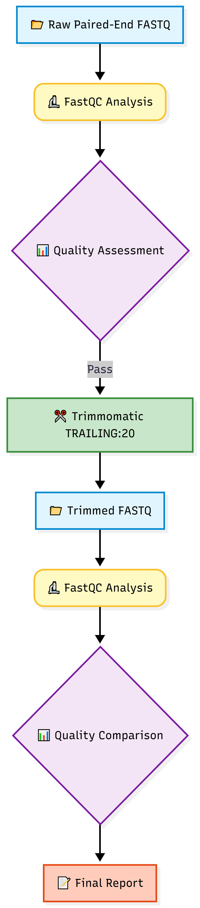

# NGS Quality Control & Read Trimming Pipeline


**A reproducible Galaxy-based workflow for quality assessment and preprocessing of Illumina paired-end sequencing data using FastQC and Trimmomatic.**

---

## 📌 Overview

This project demonstrates the **first stage of a typical Next Generation Sequencing (NGS) analysis pipeline**—evaluating raw sequencing data quality and performing quality trimming before downstream analyses.

The entire workflow was built and executed using the **Galaxy** platform, making it fully reproducible and beginner-friendly.

### Objectives

* Assess raw sequencing quality using **FastQC**
* Remove low-quality bases using **Trimmomatic**
* Compare sequencing quality before and after trimming
* Validate whether preprocessing was necessary

---

## 🧬 Dataset

| Property                | Value                            |
| ----------------------- | -------------------------------- |
| **Source**              | NCBI Sequence Read Archive (SRA) |
| **Accession**           | **SRR9903725**                   |
| **Organism**            | *Homo sapiens*                   |
| **Experiment**          | CRISPR-edited stem cells         |
| **Sequencing Platform** | Illumina                         |
| **Library Type**        | Paired-End                       |
| **Read Length**         | 150 bp                           |
| **Quality Encoding**    | Sanger                           |
| **Total Reads**         | 2,918,654 read pairs             |

---

## 🛠️ Tools Used

| Tool            | Purpose                           |
| --------------- | --------------------------------- |
| **Galaxy**      | Workflow execution platform       |
| **FastQC**      | Sequencing quality assessment     |
| **Trimmomatic** | Quality trimming                  |
| **GitHub**      | Version control and documentation |

---

## 🔄 Workflow

```text
Raw Paired-End FASTQ
          │
          ▼
      FastQC
          │
          ▼
 Initial Quality Assessment
          │
          ▼
 Trimmomatic (TRAILING:20)
          │
          ▼
 Trimmed FASTQ Files
          │
          ▼
      FastQC
          │
          ▼
 Final Quality Assessment
```

### Workflow Diagram 

<p align="center">
  
</p>

---

# 📊 Results

## FastQC Summary

| Quality Metric               | Raw Reads | Trimmed Reads |
| ---------------------------- | --------- | ------------- |
| Per Base Sequence Quality    | ✅ PASS    | ✅ PASS        |
| Per Sequence Quality Scores  | ✅ PASS    | ✅ PASS        |
| Adapter Content              | ✅ PASS    | ✅ PASS        |
| Per Sequence GC Content      | ✅ PASS    | ✅ PASS        |
| Sequence Length Distribution | ✅ PASS    | ✅ PASS        |
| Overrepresented Sequences    | ✅ PASS    | ✅ PASS        |
| Sequence Duplication Levels  | ✅ PASS    | ✅ PASS        |

---

## Before vs After Trimming

<p align="center">

&nbsp;&nbsp;

</p>

<p align="center">
<b>Raw Reads</b> &nbsp;&nbsp;&nbsp;&nbsp;&nbsp;&nbsp;&nbsp;&nbsp;&nbsp;&nbsp;&nbsp;&nbsp;&nbsp;&nbsp;&nbsp;&nbsp;&nbsp;&nbsp;&nbsp;&nbsp;&nbsp;&nbsp;&nbsp;&nbsp;&nbsp;&nbsp;&nbsp;&nbsp;&nbsp;&nbsp;&nbsp;&nbsp;&nbsp;&nbsp;&nbsp;&nbsp;&nbsp;
<b>Trimmed Reads</b>
</p>

> **Observation:**
> The quality profile remained essentially unchanged after trimming, indicating that the original sequencing data already possessed consistently high-quality bases. 

---

## Trimmomatic Statistics

| Metric           |     Value |
| ---------------- | --------: |
| Input Read Pairs | 2,918,654 |
| Both Surviving   | 2,918,654 |
| Forward Only     |         0 |
| Reverse Only     |         0 |
| Dropped          |         0 |
| Read Retention   |  **100%** |

Detailed summary:

```text
results/trimming/Trimming_Summary.txt
```

---

# 🔍 Key Findings

* Raw sequencing reads exhibited **excellent overall quality**.
* Average Phred quality scores remained **above Q30** across nearly all sequencing cycles.
* No adapter contamination was detected.
* GC-content followed the expected distribution.
* Trimmomatic found **no bases below the Q20 threshold**.
* Every read pair survived trimming (**100% retention**).
* The dataset was immediately suitable for downstream analyses such as alignment and variant calling.

---

# 📂 Repository Structure

```text
NGS-Quality-Control-Pipeline/
│
├── README.md
│
├── assets/
│   └── workflow.png
│
├── workflow/
│   └── galaxy_workflow.ga
│
├── data/
│   └── sample_information.md
│
├── results/
│   ├── raw_fastqc/
│   │   ├── html_reports/
│   │   └── screenshots/
│   │
│   ├── trimmed_fastqc/
│   │   ├── html_reports/
│   │   └── screenshots/
│   │
│   └── trimming/
│       └── Trimming_Summary.txt
│
├── docs/
│   ├── methodology.md
│   └── report.pdf
│
└── LICENSE
```

---

# 🚀 How to Reproduce

1. Download **SRR9903725** from the NCBI Sequence Read Archive.
2. Upload paired-end FASTQ files into Galaxy.
3. Run **FastQC** on the raw reads.
4. Execute **Trimmomatic** using:

```text
TRAILING:20
```

5. Run **FastQC** again on the trimmed reads.
6. Compare both FastQC reports.
7. Review the trimming summary.

---

# 📈 Pipeline Outcome

| Step               | Status      |
| ------------------ | ----------- |
| Data Import        | ✅ Completed |
| Initial FastQC     | ✅ Completed |
| Read Trimming      | ✅ Completed |
| Final FastQC       | ✅ Completed |
| Quality Validation | ✅ Completed |

---

# 🔮 Future Improvements

* Compare multiple trimming thresholds
* Adapter trimming using **ILLUMINACLIP**
* Integrate **MultiQC**
* Read alignment using **BWA** or **Bowtie2**
* SAM/BAM processing with **SAMtools**
* Variant calling using **GATK**
* Workflow automation
* Docker containerization
* Nextflow implementation

---

# 📚 References

* Andrews, S. **FastQC: A Quality Control Tool for High Throughput Sequence Data.**
* Bolger, A. M., Lohse, M., & Usadel, B. **Trimmomatic: A Flexible Trimmer for Illumina Sequence Data.** *Bioinformatics* (2014).
* Galaxy Project Documentation.

---

# 👨‍💻 Author

**Satvik**

B.Tech Bioinformatics
Jaypee University of Information Technology (JUIT), Solan, Himachal Pradesh

Summer Project • 2026

---

⭐ **If you found this project useful, consider giving the repository a star!**
